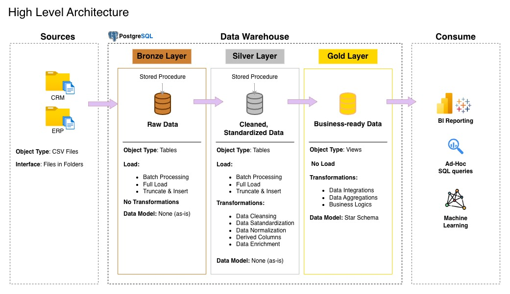

# Data Warehouse & Analytics Project: Medallion Architecture 🚀

Welcome to my Data Engineering portfolio. This project demonstrates the implementation of a modern **Data Warehouse** using a **Medallion Architecture** (Bronze, Silver, Gold) hosted on **PostgreSQL**.

---

## 🙏 Acknowledgments

I would like to express my sincere gratitude to **Baraa Khatib Salkini** (**Data With Baraa**). This project is built following his expert curriculum and architectural framework. His guidance on SQL best practices and data modeling has been foundational for this implementation.

---

## 🏗️ High-Level Architecture

The project follows the Medallion design pattern to ensure data quality and lineage:

1.  **Bronze Layer (Raw)**: Direct ingestion of CRM and ERP CSV files into physical tables using a "Truncate & Insert" strategy.
2.  **Silver Layer (Cleansing)**: Data standardization, handling NULLs, and cleaning formats. Normalization of source data.
3.  **Gold Layer (Analytical)**: Business-ready **Star Schema** (Fact & Dimension tables) implemented via SQL Views for high-performance reporting.

---

## 📖 Project Objectives

### 1. Data Engineering (Infrastructure)
- **ETL Pipelines**: Automated data loading from source systems using Stored Procedures.
- **Data Integration**: Merging fragmented data from CRM and ERP sources into a unified model.
- **Data Integrity**: Implementation of **Surrogate Keys** and **Foreign Key checks** to ensure a robust Star Schema.

### 2. Data Analytics (Insights)
- **EDA (Exploratory Data Analysis)**: Leveraging the Gold layer to answer business questions.
- **KPI Tracking**: Analyzing customer behavior, product performance, and sales trends.
- **Demographic Analysis**: Advanced age and gender distribution reporting using PostgreSQL-specific functions (`AGE`, `EXTRACT`).

---

## 🛠️ Tools & Technologies

- **Database:** [PostgreSQL](https://www.postgresql.org/)
- **Management:** [pgAdmin 4](https://www.pgadmin.org/)
- **Version Control:** Git & GitHub
- **Methodology**: Medallion Architecture & Dimensional Modeling (Star Schema)

---

## 📂 Repository Structure

- `01_bronze/`: DDL and Stored Procedures for raw data ingestion.
- `02_silver/`: Scripts for data cleansing and standardization.
- `03_gold/`: Final analytical model (Fact & Dimension views).
- `docs/`: Technical documentation, naming conventions, and architecture diagrams.
- `analysis/`: Exploratory Data Analysis (EDA) scripts and business queries.

---
